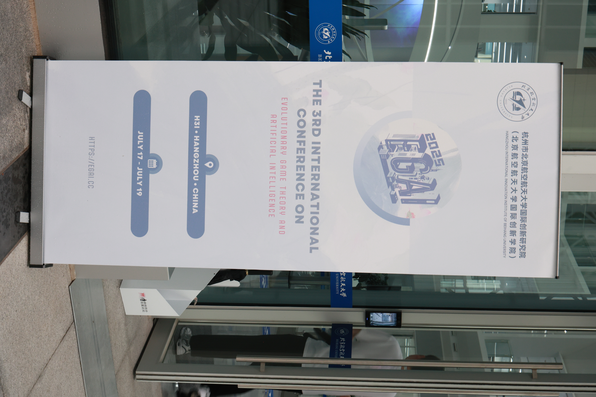
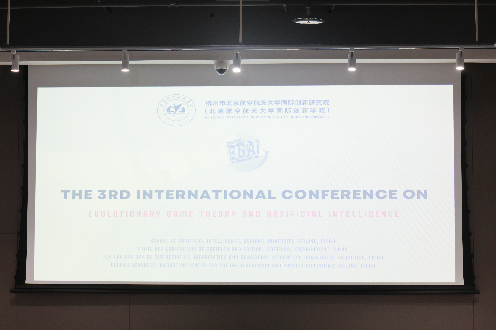
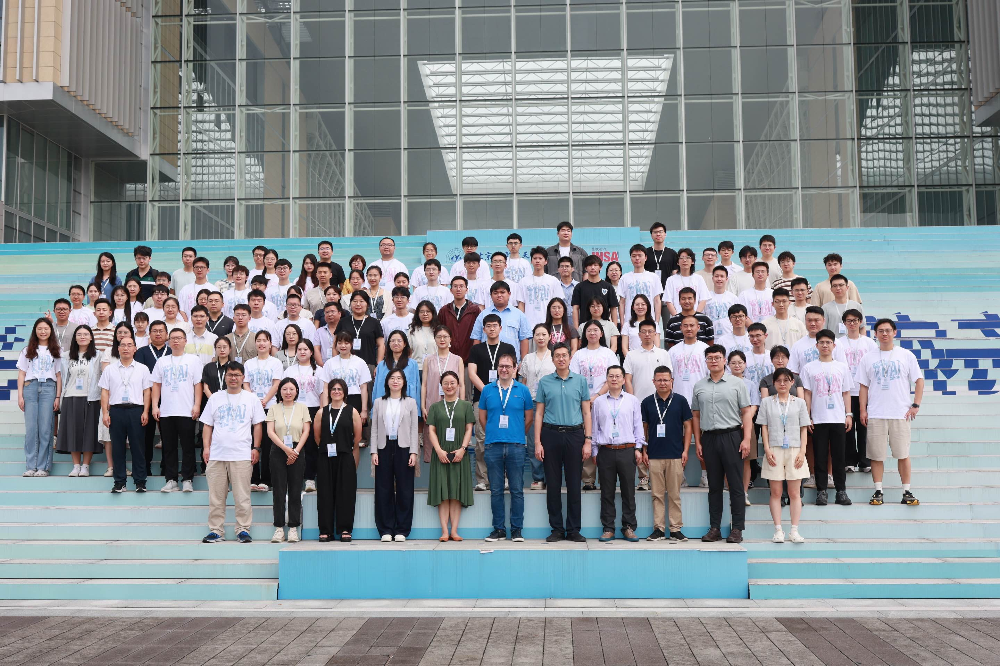

Last week, I had the opportunity to attend the 2025 Game Theory and Artificial
Intelligence Conference at Beihang University's Hangzhou International Campus.
Now in its third year, the conference has established itself as a key meeting
point for researchers working on evolutionary game theory and its intersection
with artificial intelligence in China. The event was organized by Associate
Professors Wang Xin and Chen Xingru from Beihang University's Institute of
Artificial Intelligence, with support from Professor Feng Fu of Dartmouth
University.

  
  

The two-day program featured an impressive lineup of keynote speakers:

- **Professor Hirokazu Shirado** (Carnegie Mellon University) presented
  innovative work on human-computer hybrid intelligence for autonomous vehicle
  coordination.  
- **Dr. Hu Shuyue** (Shanghai AI Laboratory) explored emergent cooperative
  behavior in multi-agent systems powered by large language models.  
- **Professor Fernando P. Santos** (University of Amsterdam) discussed how large
  language models influence and predict human decision-making.  
- **Professor Christian Hilbe** (Institute of Science and Technology Austria)
  gave an in-depth presentation on the evolution of non-optimal learning
  mechanisms and their implications for strategic behavior across different game
  types.  
- **Dr. Saptarshi Pal** (Harvard University) introduced the concept of
  prediction-proof strategies in memory-one strategies of repeated games.
- **Professor Ran Zhuo** (University of Michigan) presented a data-driven
  algorithmic model to support NIH research funding decisions, using large-scale
  empirical data to address broader questions in social resource allocation and
  innovation.  
- **Professor Julusa Liu** (Peking University) discussed her interdisciplinary
  research combining human behavioral experiments, computational modeling, fMRI,
  and graph neural networks to study group learning, representation, and
  decision-making within social network structures.

## Personal contributions

I was honored to present my recent work on direct reciprocity, as well as to
deliver a tutorial on game theory using Python.
Please find the slides for both talks here: [https://nikoleta-v3.github.io/presentations/](https://nikoleta-v3.github.io/presentations/) — or simply: [talk](https://nikoleta-v3.github.io/presentations/EGAI2025.pdf), [tutorial](https://nikoleta-v3.github.io/presentations/EGAITutorial2025.pdf).

## Emerging research

A highlight of the conference was the poster session, which showcased work by
early-career researchers. The organizers also recognized outstanding
contributions through “Best Paper” and “Best Poster” awards, reflecting a strong
commitment to fostering new talent in the field.

## Conference impact

What made this conference particularly valuable was its focused scope. I don’t
think I’ve ever attended a conference where every single presentation engaged
directly with questions in evolutionary game theory. This made it easy to have
meaningful conversations with colleagues, as we shared common ground or
overlapping interests. At the same time, it offered new perspectives on what
others in our field are currently working on.

It’s clear that this conference is becoming the main event where the game theory
community in China comes together.

I look forward to seeing how this conference grows in future years and hope to
continue contributing to its success.

